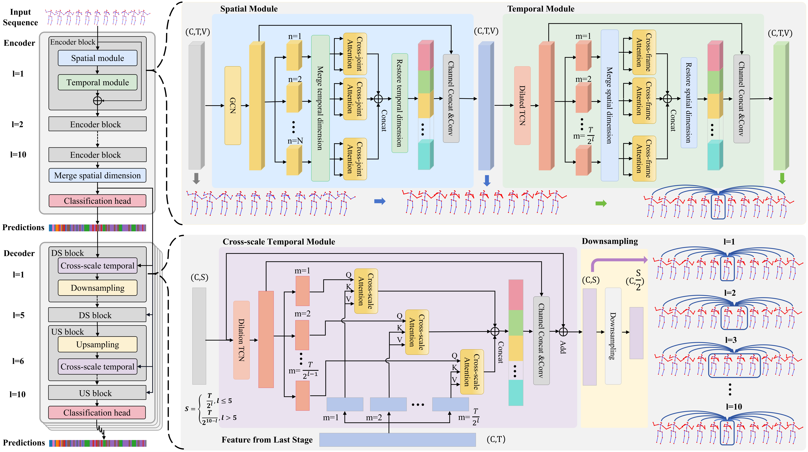

# <p align=center> Snippet-Aware Transformer with Multiple Action Elements <br>for Skeleton-Based Action Segmentation</p>


> **Abstract:** *Skeleton-based Temporal Action Segmentation (STAS) aims to densely segment and classify human actions within lengthy untrimmed skeletal motion sequences. Current methods primarily rely on Graph Convolution Networks (GCN) for intra-frame spatial modeling and Temporal Convolution Networks (TCN) for inter-frame temporal modeling to discern motion patterns. However, these approaches often overlook the distinctive nature of essential action elements across various actions, including engaged core body parts and key sub-actions. This oversight limits the ability to distinguish different actions within a given sequence. To address these limitations, the Snippet-aware Transformer with Multiple Action Elements (ME-ST) is proposed to enhance the discrimination and segmentation among actions, which leverages spatial-temporal attention along joints and sequence to identify core joints and key sub-actions at different scale. Specifically, in terms of spatial domain, the Intra-snippet Cross-joint Attention (CJA) module divides the sequence into distinct snippets and computes attention to establish intricate joint semantic relationships, emphasizing the identification of core motion joints. In terms of temporal domain, in the encoder, the Intra-snippet Cross-frame Attention (CFA) module segments the sequence in a block-wise expansion manner and establishes inter-frame relationships to highlight the most discriminative frames. In the decoder, clip-level representations at various temporal scales are initially generated through a hourglass-like sampling process, followed by the Intra-snippet Cross-scale Attention (CSA) module to integrate key clip information across different time scales. Performance evaluation on five public datasets demonstrates that ME-ST achieves state-of-the-art performance.* 
<p align="center">
     <br />
    <em> 
    Figure 1: Overview of the ME-ST.
    </em>
</p>


## Introduction
The PyTorch code serves as the authoritative implementation for "Snippet-Aware Transformer with Multiple Action Elements for Skeleton-Based Action Segmentation".
> * Our proposed ME-ST enhances action segmentation and discrimination through intra-snippet attention over multiple action elements
> * The implementation code comprises training and testing codes for ME-ST both without the BRB branch and with the BRB branch.
> * A single GPU (NVIDIA RTX 3090) can perform all the experiments.

## Enviroment
Pytorch == `1.10.1+cu111`, 
torchvision == `0.11.2`, 
python == `3.8.13`, 
CUDA==`11.4`

### Enviroment Setup
Within the newly instantiated virtual environment, execute the following command to install all dependencies listed in the `requirements.txt` file.

``` python
pip install -r requirements.txt
```

## Preparation
### Datasets
This study conducted experiments on five publicly available datasets: LARa, HuGaDB, TCG, PKU-MMD (X-sub), and PKU-MMD (X-view). 
All datasets are downloadable from 
[GoogleDrive](https://drive.google.com/file/d/1TB5UJUKQfvaFWYEETEmOnJs4rYgwnyWW/view?usp=sharing) (~3.7GB).

### Pretrained Models

Pretrained models of ME-ST, both without the BRB branch and with the BRB branch, on the five datasets are available for download from 
[GoogleDrive](https://drive.google.com/file/d/1QD0PlfS38WwoXORMcuAcZ5pNZCo-FAsQ/view?usp=sharing) (~218MB).

### Folder Structure
Orgnize the pretrained model and dataset folder in the following structure (**Note**: please check it carefully):


```
|-- configs/
|-- Datasets/
|   |-- LARA/
|   |   |-- features/
|   |   |-- groundTruth/
|   |   |-- gt_arr/
|   |   |-- gt_boundary_arr/
|   |   |-- splits/
|   |   |-- mapping.txt
|   |-- hugadb/
|   |-- tcg/
|   |-- PKU-subject/
|   |-- PKU-view/
|
|-- models/
|-- pre_trained_models/
|   |-- ME-ST/
|   |   |-- lara/
|   |   |   |-- best_model.pt
|   |   |-- hugadb/
|   |   |-- tcg/
|   |   |-- pku-subject/
|   |   |-- pku-view/
|   |-- ME-ST+BRB/
|   |   |-- lara/
|   |   |   |-- best_model.pt
|   |   |-- hugadb/
|   |   |-- tcg/
|   |   |-- pku-subject/
|   |   |-- pku-view/
|
|-- result/
|-- Tools/
|-- Dataset.py
|-- ME-ST_train.py
|-- ME-ST_test.py
|-- ME-ST+BRB_train.py
|-- ME-ST+BRB_test.py
|-- ..........

```

## Get Started

### Training

To train our model on different datasets (taking the LARa dataset as an example), use the following commands:

ME-ST without BRB:
```shell
python ME-ST_train.py --dataset lara --cuda 0
```

ME-ST with BRB:
```shell
python ME-ST+BRB_train.py --dataset lara --cuda 0
```

Here, `--dataset` can be one of the following: lara, hugadb, tcg, pku-subject, or pku-view. 
`--cuda` specifies the ID number of the GPU to be used for training. 


The training results and models will be stored by default in `result/lara/train/`.

If you wish to modify other parameters, please make the necessary changes to the corresponding dataset's `.yaml` file in `configs/`.


### Evaluation

To evaluate the performance of the results obtained after the training, use the following commands:


ME-ST without BRB:
```shell
python ME-ST_test.py --dataset lara --cuda 0 --model_path pre_trained_models/ME-ST/lara/best_model.pt
```

ME-ST with BRB:
```shell
python ME-ST+BRB_test.py --dataset lara --cuda 0 --model_path pre_trained_models/ME-ST+BRB/lara/best_model.pt
```

Here, `--dataset` and `--cuda` have the same meaning as in the training command. 
`--model_path` is the path to the `.pt` file containing the trained model parameters.

## Acknowledgement
The ME-ST model and code are built upon [MS-GCN](https://github.com/benjaminfiltjens/ms-gcn). 
Additionally, the BRB branch we utilized is derived from [ASRF](https://github.com/yiskw713/asrf). 

We extend our gratitude to the authors for openly sharing their code and datasets.

## License
This repository is released under the [MIT](https://choosealicense.com/licenses/mit/) License.

## Contact
If you have any further inquiries, please feel free to email Haoyu Ji at `jihaoyu1224@gmail.com`. We will respond within a few days.


